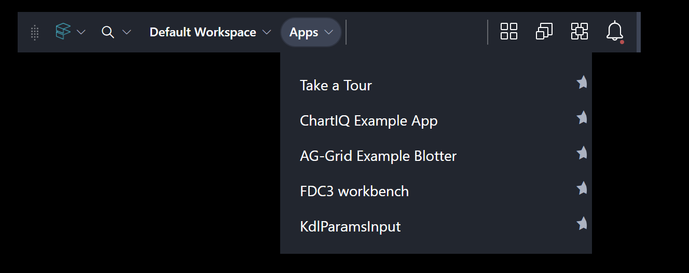
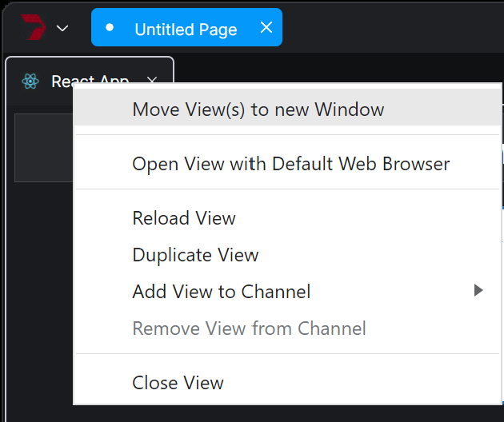

# Weekly Meeting: 05/19/2022

<br>

## Single Instance of `ChannelProvider`

<br>

-   [ ] What is the best place to instantiate `ChannelProvider` if we want this to stay alive for the life of the application?

    -   Can this be instantiated in the workspace-starter (ie where `Home` and `provider & platform` is initialized)?
    -   If we initialize it there, then can we get access to this object from `platform windows` and `platform views`?
    -   something similar to `fin.me` or `fin.Desktop` -- eg. `fin.myIpcChannels.Providers.ChartProvider`
    <br><br>
    -   _Suggestions by PJ:_
        -   _it should be possible to inject other objects into `fin` namespace_
        -   _but `OpenFin` does not provide anything out-of-the-box for this_
        -   _we will have to try it out ourseleves_
        -   _OpenFin may provide an example, if they have such implementation amongst their developers_
        -   _PJ suggested to use IOC -- like: [inversify](https://inversify.io) - example: [inversify GitHub](https://github.com/inversify/inversify-basic-example)_ 
    <br><br>

---

## Exceptions

-   [ ] When I open the publisher window, I get these exceptions and couldn't find the source of these exceptions
    ```python
    Failed to load resource: the server responded with a status of 404 (Not Found)
    Uncaught (in promise) DOMException: Failed to execute 'addIceCandidate' on 'RTCPeerConnection': Error processing ICE candidate
    ```
-   [ ] If I open `subscriber-views` one-by-one, then I don't get any errors, but I open 10+ of them then I get these errors
    ```python
    Uncaught (in promise) DOMException: Failed to execute 'addIceCandidate' on 'RTCPeerConnection': Error processing ICE candidate
    Uncaught (in promise) DOMException: Failed to execute 'addIceCandidate' on 'RTCPeerConnection': Error processing ICE candidate
    Uncaught TypeError: Cannot read properties of undefined (reading 'call')
        at RTCPeerConnection.RTCEndpoint.connectionStateChangeHandler (<anonymous>:3:42663)
    Uncaught TypeError: Cannot read properties of undefined (reading 'call')
        at RTCPeerConnection.RTCEndpoint.connectionStateChangeHandler (<anonymous>:3:42663)
    Uncaught TypeError: Cannot read properties of undefined (reading 'call')
        at RTCPeerConnection.RTCEndpoint.connectionStateChangeHandler (<anonymous>:3:42663)
    ```
-   [ ] When I publish messages, I get these errors even though the messages are published!
    ```python
    "stack": "Error: No action registered at target for chart-data-generation-starting\n    at defaultAction (<anonymous>:3:24005)\n    at r (<anonymous>:3:24240)\n    at ChannelClient.processAction (<anonymous>:3:24304)\n    at RTCEndpoint.ChannelClient.processAction (<anonymous>:3:25815)\n    at RTCDataChannel.<anonymous> (<anonymous>:3:43646)",
    "message": "No action registered at target for chart-data-generation-starting"
    
    "stack": "Error: No action registered at target for chart-data\n    at defaultAction (<anonymous>:3:24005)\n    at r (<anonymous>:3:24240)\n    at ChannelClient.processAction (<anonymous>:3:24304)\n    at RTCEndpoint.ChannelClient.processAction (<anonymous>:3:25815)\n    at RTCDataChannel.<anonymous> (<anonymous>:3:43646)",
    "message": "No action registered at target for chart-data"
    ```
<br><br>
-   _OpenFin and Sachin ToDo:_
    -   _Sachin to provide the source-code to OpenFin so that they can replicate these errors on their side_
    -   _OpenFin will provide updates thereafter_
<br><br>
---

## ChannelAPI throughput (_to be investigated by OpenFin once EagleSeven provides source-code to replicate it_)

-   [ ] `await Promise.all(provider.publish)` goes into ether!
    ```typescript
    public async publishTopicDataAsync(topic: ETopic, data: any): Promise<void> {
        try {
            const diffWithWorker = Date.now() - data.workerSentTime;
            const dataToSend = { ...data, ipcSentTime: Date.now() };
            
            const startTime = Date.now();
            await Promise.all(this._channelProvider.publish(topic, dataToSend));
            //this._channelProvider.publish(topic, dataToSend);

            // everything below don't execute if I use await Promise.all(...)
            const diff = Date.now() - startTime;

            const chartData: IChartData = data as IChartData;
            if (chartData) {
                console.log(`ipcBusPublisher | publishTopicDataAsync | ${topic} | 
                            connections: ${this._channelProvider.connections.length} | 
                            counter: ${data.counter} | 
                            worker -> this: ${diffWithWorker.toFixed(2)} | 
                            this -> clients: ${diff.toFixed(2)} `);
            } else {
                console.log(`ipcBusPublisher | publishTopicDataAsync | ${topic} | 
                            connections: ${this._channelProvider.connections.length} | 
                            worker -> this: ${diffWithWorker.toFixed(2)} | 
                            this -> clients: ${diff.toFixed(2)} `);
            }
        } catch (error) {
            console.log('publish error: ', error);
        }
    }
    ```
-   [ ] As number of subscribers increase, the time a message takes to be delivered keeps on increasing. I expected this, but not that high!
    -   Demo
<br><br>
-   _OpenFin and Sachin ToDo:_
    -   _Sachin to provide the source-code to OpenFin so that they can replicate these errors on their side_
    -   _OpenFin acknowledged that using `rpc` protocol should be very fast_
    -   _Once they have the source-code, they will replicate the issue on their end and will then provide updates_
<br><br>


---

## Other Misc Topics

-   [ ] Views don't occupy 100% height when arranging using `grid layout`
    - Demo
      - _Sachin to replicate this in Chrome or Edge and if no issues there, then ask OpenFin to look into it_
    <br><br>
  - [ ] How to open views in one of the layout arrangements like `grid` or `rows` or `columns` rather than `tabs`?
      - _OpenFin only creates views as `tabs`_
      - _Its upto the user to layout the view in `grid` or some other arrangements_
    <br><br>
  - [ ] I am still confused as to how to open views with different `rendering threads`?
    -   [ ] each view opens in different process (ie disting pid) correct? (based on my code)
    -   [ ] does it mean its using different rendering thread?
    -   [ ] how do we prove it?
    -   [ ] is it possible to open a view in same process but with different rendering thread?
      - _We will discuss more on all these questions during the next weekly POC meeting_
    <br><br>

---
---
---

# Weekly Meeting: 05/05/2022

<br>
<br>

## Feature Request Status Update

<br>

-   [ ] Snap window

    -   _Suggestions by Chris:_
        -   _this feature is removed due to clashes with OS snapping feature (Win 11)_
        -   _OpenFin will not provide this feature and suggested to not implement it due to the headaches associated with this feature_
        -   _Instead use multiple windows and docking within them which is far more advanced_
        -   _These windows can be laid out the way a user wants and will be saved and loaded during startup_ <br><br>

-   [ ] App Dashboard similar to Finsemble or Glue42
    -   _OpenFin to look into this and get back to us_ <br><br>
    -   
        <br><br>

---

## Workspace SDK

<br>

-   [ ] Do we have to customize `platform-window`?

    -   meaning use **OpenFin's as-is** `platform-window`
    -   what are the features it provides?
        -   _Openfin workspace seed provides everything and there shouldn't be a need to change anything except provide a list of apps in the `app.json` file_
        -   _but knowing the seed project will be helpful in cases when certain customizations need to be made (eg login/auth)_ <br><br>

-   [ ] How do we change the `HOME` hot-key from `CTRL+SPACE` to some other key?

    -   _Currently this is done my adding a registry key_
    -   _Openfin will get back to us on an alternative to using registry key_ <br><br>

-   [ ] How do we customize the `right-click-context-menu` on the tab header?

    -   _Openfin will get back to us on this_ <br><br>
    -   
        <br><br>

-   [ ] It takes two clicks to close a workspace window - possible bug?
    -   _Openfin confirmed this is a bug and will address in upcoming releases_ <br><br>

---

## Platform API

<br>

-   [ ] What is the best way to figure out if my App is running under OpenFin

    -   Show my code <br><br>
    -   ```ts
        import { Fin } from '@openfin/core/fin'; // my code

        // Openfin suggested to use this approach
        import { fin } from 'openfin-adapter/src/mock'; // workspace seed
        ```

-   [ ] How to customize the entire window frame?
    -   set `frame: false` in the manifest json and customize as required?
    -   do you have a sample of this?
        -   _Openfin suggested to use workspace instead which has far more features than what platform api provides_

---

## General

<br>

-   [ ] Any easier development setup?

    -   first build
    -   then run app
    -   then serve client (platform or workspace)
    -   then launch (OpenFin -l -u app-manifest.json)
        -   _as it stands, it's the only option as various static files need to be served_
        -   _but in release mode, these static files are served from a server so its a non-issue_
        -   _such development setup is quite common these days_

-   [ ] ...

---

## Next Week

<br>

-   [ ] IPC, ChannelApi, etc.
    -   _Openfin suggests to use Channel API because it supports both IPC and WebRTC_
    -   _Openfin will provide any additional samples they may have to speed up the POC process for this feature_ <br><br>
-   [ ] A bit about theming/styling

---
